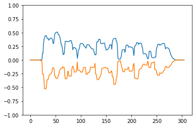

# Waveform Silhouette (LaughNet)

This is the implementation of waveform silhouette used to train the LaughNet model described in the paper ["LaughNet: synthesizing laughter utterances from waveform silhouettes and a single laughter example", Hieu-Thi Luong, Junichi Yamagishi](https://arxiv.org/abs/2110.04946). The module is declared in [silhouette.py](silhouette.py).

The experiments described in the LaughNet paper were based on [HiFi-GAN Vocoder Source Code](https://github.com/jik876/hifi-gan). If there are some details that were not mentioned in the paper, they are most likely default settings of HiFi-GAN.

A more details instruction can be found in the [interactive notebook](notebook.ipynb)

## License
[MIT License](LICENSE)